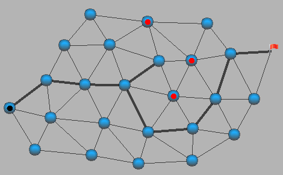

# ExploAlgo

# Sommaire

1. [Présentation](#1)
2. [Outils Utilisés](#2)
3. [Résultat](#3)

<h1 id="1">1. Présentation</h1>

Représentations graphique de graphes généré en java, que l'on peut creer grâce à une fenetre en cliquant pour ajouter un noeud ou en maintenant un noeud pour le déplacer. 
Par la suite, nous pouvons trouver rapidement grâce à un algorithme A*, le plus court chemin entre 2 sommets en évitant des noeuds si c'est indiqué.

<h1 id="2">2. Outils Utilisés</h1>

* ``Java``

<h1 id="3">3. Résultat</h1>

Représentation d'un graphe et du chemin le plus court
 

